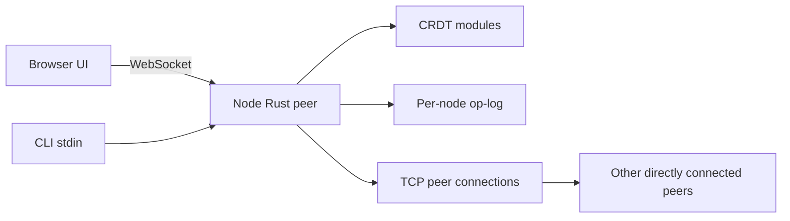

# ARCHITECTURE

## Overview

This repository implements a peer-to-peer collaborative text editor built
around custom Conflict-free Replicated Data Types (CRDTs). The primary
deliverable is the Rust backend node: CRDT logic, peer transport, persistence,
CLI, and a WebSocket bridge. The frontend is an optional static demo that talks
to a running backend node over WebSocket.

## High-Level Components

- **Backend Rust crate** (`backend/`)
  - [`backend/src/crdt/`](../backend/src/crdt/) — hand-written CRDTs:
    G-Counter, OR-Set, and RGA sequence.
  - [`backend/src/network/`](../backend/src/network/) — peer transport and
    wire protocol.
  - [`backend/src/storage/`](../backend/src/storage/) — append-only JSON-Lines
    operation log.
  - [`backend/src/ui/`](../backend/src/ui/) — line-oriented CLI and WebSocket
    bridge for the browser frontend.
- **Frontend** (`frontend/`)
  - Static HTML/CSS/JS client. It renders full text snapshots and sends editing
    intents; it does not run CRDT logic.

## Data Flow

1. A user edits through the CLI or browser.
2. The node converts the visible text position into a CRDT operation:
   `Insert { after, ch }` or `Delete { target }`.
3. The node applies the operation locally immediately.
4. The operation is appended to that node's JSON-Lines op-log.
5. The operation is broadcast to active peer connections as `Message::Op`.
6. Remote peers apply the operation, retrying later if its anchor/target has
   not arrived yet.
7. Browser clients receive a full `Message::State { text }` snapshot after
   applied operations.

## CRDTs

- **G-Counter** — state-based grow-only counter with per-peer slots and
  element-wise max merge:
  [`gcounter.rs`](../backend/src/crdt/gcounter.rs).
- **OR-Set** — observed-remove set with unique UUID tags and tombstones:
  [`orset.rs`](../backend/src/crdt/orset.rs).
- **RGA sequence** — ordered text CRDT using insert-after anchors, deterministic
  ordering for concurrent inserts, and tombstone deletes:
  [`sequence.rs`](../backend/src/crdt/sequence.rs).

The collaborative document is backed by the RGA. The G-Counter and OR-Set are
included to demonstrate simpler CRDT designs and their merge properties.

## Wire Protocol

Peer-to-peer traffic uses newline-delimited JSON over TCP. Browser traffic uses
WebSocket frames, but the message enum is shared.

The message envelope is defined in
[`protocol.rs`](../backend/src/network/protocol.rs). A peer operation looks like
this on the wire:

```json
{
  "type": "op",
  "from": 1,
  "seq": 0,
  "op": {
    "op": "insert",
    "after": null,
    "ch": {
      "id": { "peer_id": 1, "counter": 1 },
      "value": "A",
      "deleted": false
    }
  }
}
```

Reconnect catch-up uses `Message::Sync`:

```json
{
  "type": "sync",
  "from": 1,
  "ops": []
}
```

The browser receives snapshots:

```json
{
  "type": "state",
  "text": "hello"
}
```

## Persistence

Each node appends applied operations to a JSON-Lines op-log managed by
[`persistence.rs`](../backend/src/storage/persistence.rs). On startup, the node
loads and replays this log before opening peer connections, so the initial Sync
sent to peers includes the full local history.

Each running node should use a distinct `--log-path`, for example
`operations-1.log`, `operations-2.log`, and `operations-3.log`. Sharing the
same log file between multiple running nodes can corrupt replay semantics.

Logs persist across normal shutdown and Ctrl-C. `Peer::clear_log()` exists as a
manual reset helper, but it is not wired to a CLI command or shutdown hook.

## Networking

Peer-to-peer networking is TCP-based and asynchronous using Tokio. Every node
can listen for inbound peers and dial outbound peers supplied through
`--connect`.

The current topology is not gossip-based: operations are not relayed onward by
intermediate peers. For a three-peer demo, each peer must eventually have a
direct connection to every other peer, or it may miss edits from peers it never
talks to directly. A gossip/relay layer is listed as future work in the README.

The browser connection is separate. The WebSocket bridge exposes a UI port and
translates browser intents into backend operations. The browser never talks
directly to other peers.

## Offline / Reconnect Lifecycle

A node that loses all peer connections keeps accepting local edits. Local ops
are applied immediately and appended to the local log. If no peer-writer tasks
are subscribed at that moment, the live broadcast is harmlessly missed.

When a connection is established, `run_connection` sends a `Message::Sync`
containing all operations from the local op-log. The receiver applies that batch
with a multi-pass retry loop so out-of-order operations can still resolve once
their anchors appear.

Live `Message::Op` delivery and `Message::Sync` processing both use the same
pending-op idea:

- If an op's anchor/target is missing, it is kept in `DocState.pending`.
- The document and pending queue are protected by one mutex, so applying ops
  and draining pending ops is atomic with respect to other network tasks.
- When a later op or Sync provides the missing anchor, pending ops are retried.

Startup replay also uses the multi-pass apply helper, so an op-log containing
dependent operations out of causal order can still reconstruct the same final
document.

## ID Counters

RGA IDs are `{ peer_id, counter }`. `peer_id` is provided by `--peer-id` or
generated from a random UUID. `counter` is local and monotonically increased by
the node.

On replay or Sync, the node advances its local counter past any already-seen
operations authored by the same peer. This prevents new local inserts from
colliding with IDs that were generated in an earlier session.

## Testing And CI

Run:

```pwsh
cargo test --workspace
```

The test suite covers CRDT laws, sequence convergence, duplicate delivery,
offline catch-up, out-of-order log replay, Sync buffering, persistence, CLI
behavior, and the WebSocket bridge helpers. CI also runs `rustfmt`, `clippy`,
cross-platform tests, and coverage collection. See the
[README](../README.md) for the current CI/CD links and test summary.

## Where To Start Changing Code

- Modify CRDT behavior in [`backend/src/crdt/`](../backend/src/crdt/).
- Modify peer networking and Sync behavior in
  [`backend/src/network/peer.rs`](../backend/src/network/peer.rs).
- Modify persistence in
  [`backend/src/storage/persistence.rs`](../backend/src/storage/persistence.rs).
- Modify CLI/WebSocket behavior in [`backend/src/ui/`](../backend/src/ui/).

## Diagram



## Notes

- The backend is the main graded artifact.
- The frontend is intentionally simple; all CRDT logic lives in Rust.
- Current limitations and future work are listed in the README.
